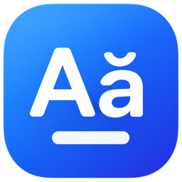

<p align="center"></p>

# GoViet — bộ gõ tiếng Việt cho Windows

GoViet là bộ gõ tiếng Việt gọn nhẹ như Unikey: một file `GoViet.exe`, chạy ở khay hệ thống, gõ Telex hoặc VNI ra Unicode trong mọi ứng dụng. Viết bằng Rust, không cần cài runtime.

Trang giới thiệu: https://zenix-vn.github.io/go-viet-windows/ · Phát triển bởi [Zenix Labs](https://zenix.vn)

## Tính năng (v0.2)

- Kiểu gõ **Telex** và **VNI**, bảng mã Unicode dựng sẵn
- Bỏ dấu tự do: `tieengs`, `tiesng`, `tiengse` đều ra `tiếng`
- Đặt dấu kiểu cũ (`hòa`, `thủy`, mặc định như Unikey) hoặc kiểu mới (`hoà`, `thuỷ`)
- Gõ lặp để hủy dấu: `ass` → `as`, `aaa` → `aa`, `ddd` → `dd`
- Tự giữ nguyên từ tiếng Anh: `class`, `text`, `window`, `email` không bị biến dạng
- Backspace xong vẫn bỏ dấu tiếp được cho từ đang gõ
- **Ctrl+Shift** hoặc click icon khay để bật/tắt tiếng Việt (icon xanh: tiếng Việt, icon xám: tiếng Anh)
- **Gõ tắt**: `vn` → Việt Nam, `VN` → VIỆT NAM; sửa bảng trong `%APPDATA%\GoViet\macros.txt`, lưu là dùng ngay
- **Chuyển mã clipboard**: TCVN3 (ABC) ↔ Unicode, VNI Windows ↔ Unicode, Unicode tổ hợp → dựng sẵn, bỏ dấu. **Ctrl+Shift+F9** lặp lại lần chuyển trước
- Menu chuột phải: Telex/VNI, kiểu đặt dấu, gõ tắt, chuyển mã, khởi động cùng Windows, giới thiệu
- Lưu cấu hình tại `%APPDATA%\GoViet\config.toml`

## Cách gõ

| Dấu | Telex | VNI |
| --- | --- | --- |
| sắc, huyền, hỏi, ngã, nặng | `s` `f` `r` `x` `j` | `1` `2` `3` `4` `5` |
| xóa dấu thanh | `z` | `0` |
| â ê ô | `aa` `ee` `oo` | `a6` `e6` `o6` |
| ă | `aw` | `a8` |
| ơ ư ươ | `ow` `uw` `uow` (hoặc `w` → `ư`) | `o7` `u7` `uo7` |
| đ | `dd` | `d9` |

## Tải về

Bản build mới nhất nằm ở mục **Actions → CI → Artifacts** (GoViet-windows-x64), hoặc **Releases** khi có tag `v*`.

## Build từ mã nguồn

Cần [Rust](https://rustup.rs) (stable) trên Windows 10/11:

```powershell
cargo build --release -p goviet-win
# file chạy: target\release\GoViet.exe
```

Gõ thử engine trên mọi hệ điều hành (`<` là Backspace):

```bash
cargo test --workspace
echo "tieengs Vieetj" | cargo run -p goviet-cli          # tiếng Việt
echo "tie61ng Vie65t" | cargo run -p goviet-cli -- --vni
```

Kiểm tra kiểu phần mã Windows trên Linux/macOS: `cargo check -p goviet-win --features check-on-other-os`.

## Cấu trúc

```
crates/
  goviet-engine/   Engine thuần Rust: Telex/VNI, đặt dấu, kiểm tra âm tiết, gõ tắt, chuyển mã
  goviet-win/      App Windows: hook bàn phím/chuột, SendInput, khay hệ thống, clipboard
    res/           Icon (bật/tắt) và manifest, nhúng vào .exe qua build.rs
  goviet-cli/      Gõ thử engine trên terminal
docs/              Trang giới thiệu (GitHub Pages)
tools/             Script sinh bảng mã TCVN3/VNI từ dữ liệu của Unikey
```

Cơ chế giống Unikey: `WH_KEYBOARD_LL` bắt phím → engine tính từ có dấu → `SendInput` gửi Backspace để xóa phần cũ rồi gõ chuỗi Unicode mới. Phím do GoViet gửi được đánh dấu bằng `dwExtraInfo` để hook bỏ qua. Click chuột, đổi cửa sổ, phím mũi tên hay dấu câu đều bắt đầu từ mới.

## Hạn chế đã biết

- Ứng dụng chạy quyền Administrator không nhận phím từ GoViet thường (giới hạn UIPI của Windows). Chạy GoViet bằng quyền Admin nếu cần gõ trong các ứng dụng đó.
- Ô có tự gợi ý (thanh địa chỉ trình duyệt, ô Excel) đôi khi nuốt Backspace. Sẽ xử lý ở bản sau.
- File .exe chưa ký số nên Windows SmartScreen có thể cảnh báo lần đầu chạy.

## Lộ trình

- [ ] Sửa lỗi ô tự gợi ý trên trình duyệt / Excel
- [x] Gõ tắt, chuyển mã clipboard, icon và thông tin phiên bản trong .exe
- [ ] Danh sách ứng dụng loại trừ / nhớ chế độ V–E theo ứng dụng
- [ ] Bộ cài đặt, ký số, tự cập nhật

## Tác giả & giấy phép

GoViet do [Zenix Labs](https://zenix.vn) phát triển, phát hành theo giấy phép MIT. Bảng mã TCVN3/VNI được sinh từ dữ liệu của bộ chuyển mã vnconv trong Unikey (Phạm Kim Long).
